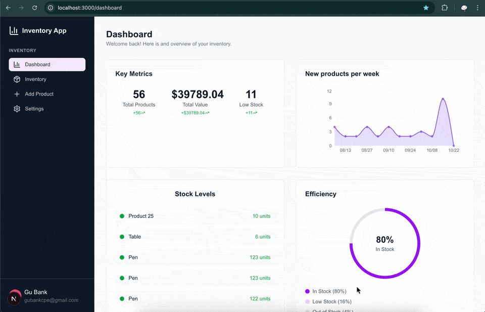
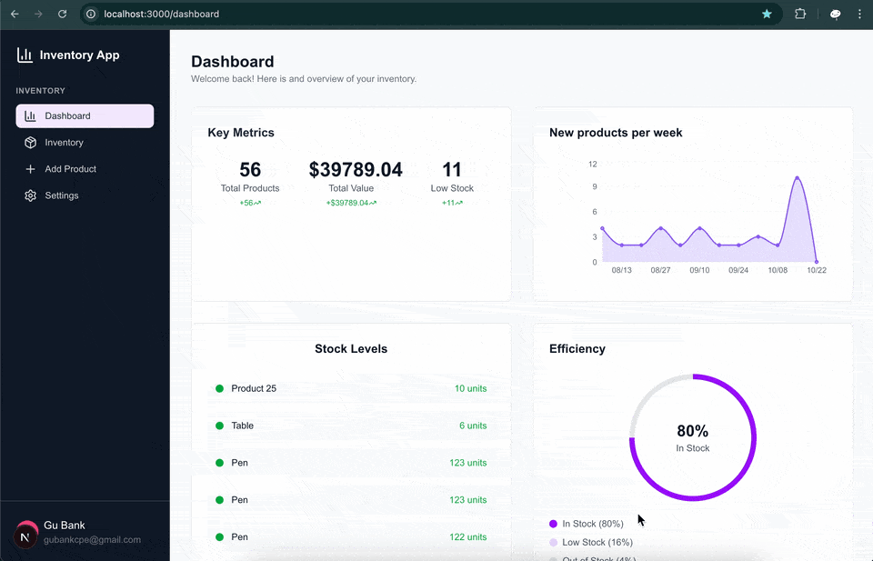
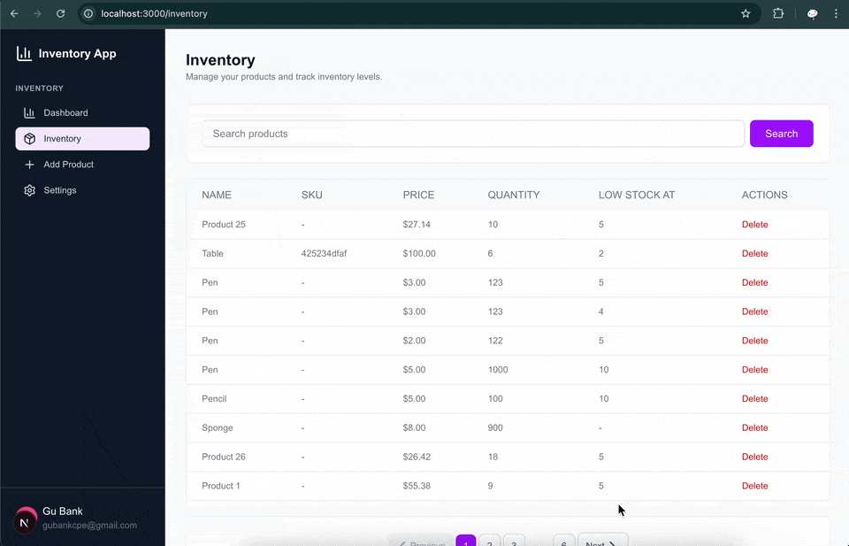
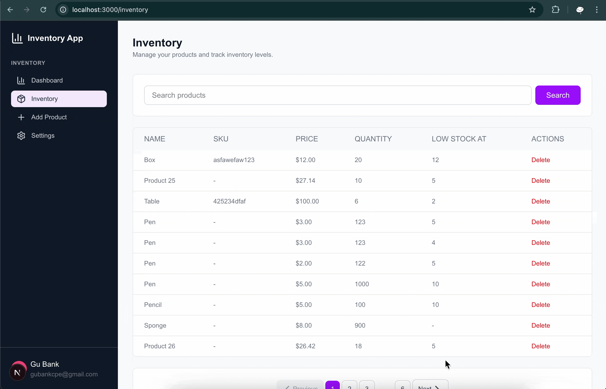
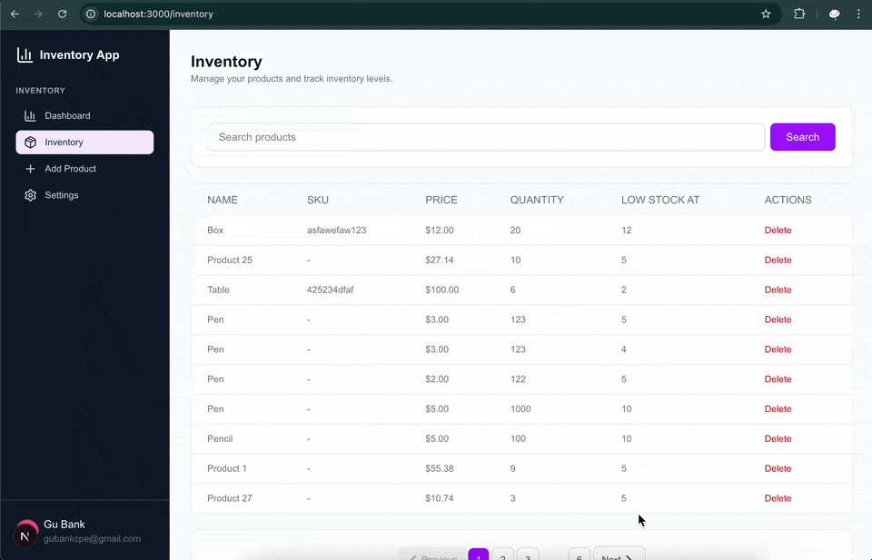
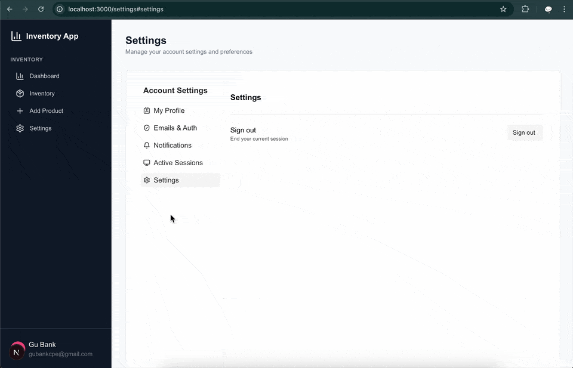

<h3 align="center">Inventory Management App</h3>

## Table of Contents

1. [Introduction](#introduction)
2. [Note](#note)
3. [Demo](#demo)
4. [Tech Stack](#tech-stack)
5. [Features](#features)
6. [Quick Start](#quick-start)
7. [What I learned](#learn)
8. [Implementation Notes](#implementation-notes)
9. [Missing Features](#missing)

## <a name="introduction">Introduction</a>

Inventory management App using Next.js, Neon, Stack Auth, Rechart, and TailwindCSS with authentication and interactive charts.

## <a name="note">⚠️ Note</a>

This project was implemented based on a tutorial video on YouTube from PedroTech [NextJS 15 FullStack Course - Build an Inventory Management Website](https://www.youtube.com/watch?v=L5CsIkO5xv4).

## <a name="demo">Demo</a>

Click on each section to toggle the demo image.

<details>
  <summary>
    Authentication
  </summary>
  <b>Sign in</b>
  <div>
    <a href="">
      
    </a>
  </div>
</details>
<details>
  <summary>
    Authenticated User
  </summary>
  <div>
    <b>Dashboard</b>
    <div>
      <a href="">
        
      </a>
    </div>
    <b>Inventory</b>
    <div>
      <a href="">
        
      </a>
    </div>
    <b>Add Product</b>
    <div>
      <a href="">
        
      </a>
    </div>
    <b>Delete Product</b>
    <div>
      <a href="">
        
      </a>
    </div>
    <b>Setting</b>
    <div>
      <a href="">
        
      </a>
    </div>
    <b>Sign out</b>
    <div>
      <a href="">
        
      </a>
    </div>
  </div>
</details>

## <a name="tech-stack">Tech Stack</a>

- Next.js - React framework for full-stack web application development
- React - JavaScript library
- TypeScript - JavaScript superset for type safety
- Stack Auth – Modern authentication solution
- Neon - Serverless PostgreSQL database service and easy to integrate with Stack Auth
- Prisma – Type-safe database ORM with migrations
- Tailwind CSS v4 - CSS framework
- Recharts – Data visualization and charting library for React
- Lucide React - Icon library for React
- Zod - Schema validation library

## <a name="features">Features</a>

Modern Authentication - Secure user registration and login with Stack Auth
Product Management - Complete CRUD operations for inventory items
Search - Find products quickly with search functionality
Pagination - Efficient data loading for large inventories
Value Tracking - Monitor total inventory value and financial metrics
Visual Analytics - Interactive charts showing inventory trends
Server Actions - Form handling with Next.js Server Actions

## <a name="quick-start">Quick Start</a>

Follow these steps to set up the project locally on your machine.

### Prerequisites

- Git
- Node.js
- npm

### Cloning the Repository

```bash
git clone https://github.com/bank8426/nextjs-inventory.git
cd nextjs-inventory
```

### Installation

Install the project dependencies using npm:

```bash
npm install
```

### Set Up Environment Variables

1. Create a new file named `.env` and copy the content inside `.env.example`
2. Replace the placeholder values with your actual credentials

```env
# create new database https://neon.com/ and enable Auth feature

# Neon Auth environment variables for Next.js
NEXT_PUBLIC_STACK_PROJECT_ID=
NEXT_PUBLIC_STACK_PUBLISHABLE_CLIENT_KEY=
STACK_SECRET_SERVER_KEY=

# Database owner connection string
DATABASE_URL=
```

### Running the Project

```bash
npm run dev
```

Your server will run on [http://localhost:3000](http://localhost:3000/)

## <a name="learn">What I learned</a>

- Stack Auth, similar to Clerk, that works as middleware for authentication and authorization, and also provides components related to that for you. To use it, you need to create an account and create a new project at [Stack Auth](https://stack.dev/) or just go to [neon.com](https://neon.com) and enable the Auth feature with Stack Auth integration, which will also give you the necessary environment variables without creating an account at Stack Auth. In the free plan, you can have 10,000 users and 1 dashboard admin, which is enough, and you can have an unlimited number of projects.

## <a name="implementation-note">Implementation Notes</a>

- Seeding mock data to the database

  - `Error: @prisma/client did not initialize yet.`

    - This happened because of the wrong import module. Use `@/app/generated/prisma` instead, as it was generated when running `npx prisma migrate dev`. This is similar to when using `shadcn`, which generates a component file for you.

    ```js
    import { PrismaClient } from "@prisma/client"; //⛔️
    import { PrismaClient } from "@/app/generated/prisma"; //✅
    ```

  - `Error [ERR_MODULE_NOT_FOUND]` when run `node prisma/seed.ts`
    - Use the command `npx tsx` instead
    ```bash
    npx tsx prisma/seed.ts
    ```

## <a name="missing">Missing Features</a>

Inventory

- Batch delete products

Toast

- Create Product
- Delete product
