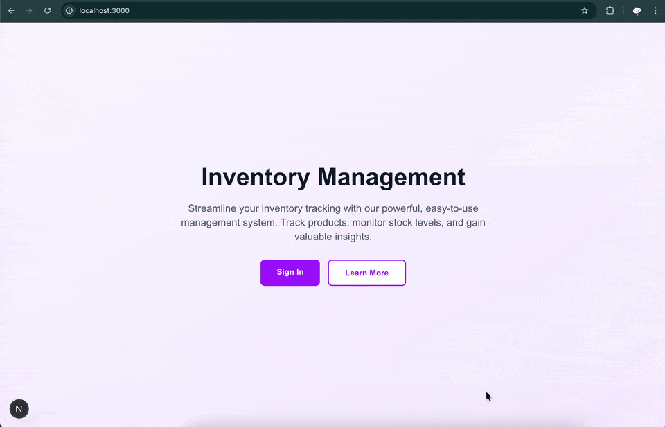

⚠️In progress...

<h3 align="center">Trello Clone</h3>

## Table of Contents

1. [Introduction](#introduction)
2. [Note](#note)
3. [Demo](#demo)
4. [Tech Stack](#tech-stack)
5. [Features](#features)
6. [Additional Feature](#additional)
7. [Quick Start](#quick-start)
8. [What I learned](#learn)
9. [Implementation Notes](#implementation-notes)
10. [Missing Features](#missing)
11. [Known Bugs](#bugs)

## <a name="introduction">Introduction</a>

TODO

## <a name="note">⚠️ Note</a>

TODO

This project was implemented based on a tutorial video on YouTube from PedroTech [NextJS 15 FullStack Course - Build an Inventory Management Website](https://www.youtube.com/watch?v=L5CsIkO5xv4).

## <a name="demo">Demo</a>

TODO
Click on each section to toggle the demo image.

<!--
<details>
  <summary>
    Authentication
  </summary>
  <b>Sign up</b>
  <div>
    <a href="">
        
    </a>
  </div>
  <b>Sign in</b>
  <div>
    <a href="">
      
    </a>
  </div>
</details>
<details>
  <summary>
    Authenticated User
  </summary>
  <div>
    <details>
      <summary>
        Dashboard page
      </summary>
      <b>Create new board</b>
      <div>
        <a href="">
          
        </a>
      </div>
      <b>Filter and search board (Edit board created_at to demo date filtering)</b>
      <div>
        <a href="">
          
        </a>
      </div>
      <b>Boards view setting</b>
      <div>
        <a href="">
          
        </a>
      </div>
      <b>Upgrade plan</b>
      <div>
        <a href="">
          
        </a>
      </div>
    </details>
    <details>
      <summary>
        Board page
      </summary>
      <b>Edit board</b>
      <div>
        <a href="">
          
        </a>
      </div>
      <b>Add/Edit Column</b>
      <div>
        <a href="">
          
        </a>
      </div>
      <b>Add task</b>
      <div>
        <a href="">
          
        </a>
      </div>
      <b>Drag and drop task to reorder task in same column</b>
      <div>
        <a href="">
          
        </a>
      </div>
      <b>Drag and drop task to change column</b>
      <div>
        <a href="">
          
        </a>
      </div>
      <b>Filter task</b>
      <div>
        <a href="">
          
        </a>
      </div>
    </details>
  </div>
</details>
<details>
  <summary>
    Unauthenticated User
  </summary>
  <div>
    <b>Home page</b>
    <div>
      <a href="">
        
      </a>
    </div>
  </div>
</details> -->

## <a name="tech-stack">Tech Stack</a>

TODO

- Next.js - React framework for full-stack web application development
- React - JavaScript library
- TypeScript - JavaScript superset for type safety
- Clerk - Authentication & subscription billing integration Middleware with pre-built UI components and themes
- Tailwind CSS v4 - CSS framework
- Shadcn UI - UI component library using primitives from Radix UI
- Lucide React - Icon library for React
- tw-animate-css - Collection of utility classes for Tailwind CSS animations

## <a name="features">Features</a>

TODO

## <a name="additional">Additional Feature</a>

TODO

## <a name="quick-start">Quick Start</a>

TODO
Follow these steps to set up the project locally on your machine.

### Prerequisites

- Git
- Node.js
- npm

### Cloning the Repository

```bash
git clone https://github.com/bank8426/nextjs-inventory.git
cd nextjs-trello-clone
```

### Installation

Install the project dependencies using npm:

```bash
npm install
```

### Set Up Environment Variables

1. Create a new file named `.env` and copy the content inside `.env.example`
2. Replace the placeholder values with your actual credentials

```env

```

### Running the Project

```bash
npm run dev
```

Your server will run on [http://localhost:3000](http://localhost:3000/)

## <a name="learn">What I learned</a>

TODO

## <a name="implementation-note">Implementation Notes</a>

TODO

## <a name="missing">Missing Features</a>

TODO

## <a name="bugs">Known Bugs</a>

TODO
